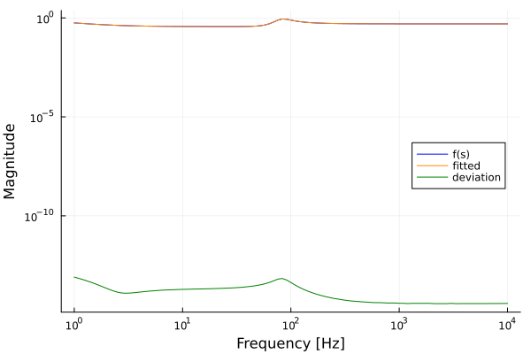
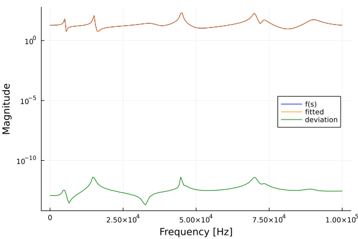
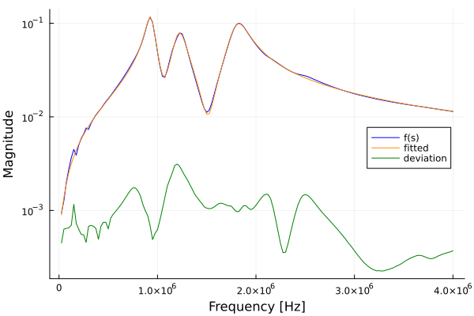
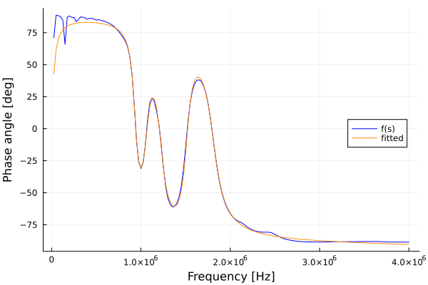
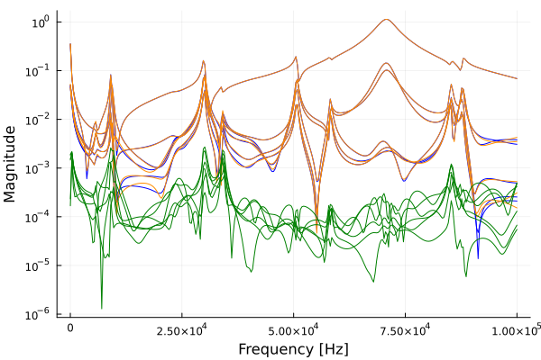
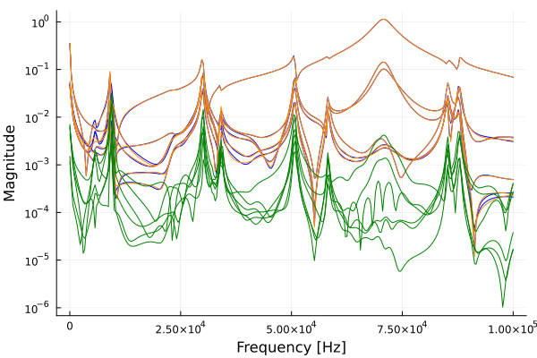
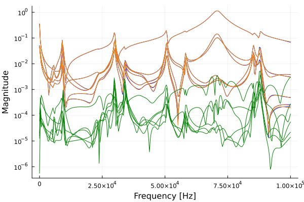
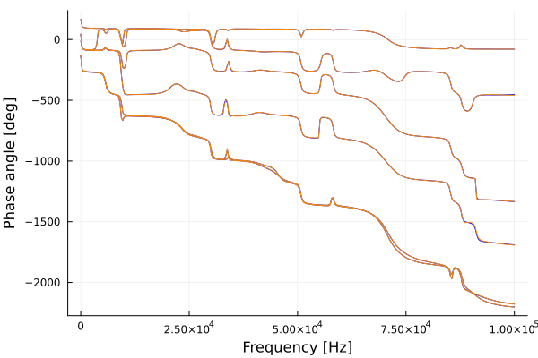

```@meta
CurrentModule = RationalVectorFitting
```

# RationalVectorFitting.jl

Documentation for [RationalVectorFitting.jl](https://github.com/pedrohnv/RationalVectorFitting.jl), a Fast Relaxed Vector Fitting algorithm in Julia.

Given a transfer function $f(s) = y$, the Vector Fitting algorithm tries to find a rational approximation

$$f(s) \approx \sum_{n=1}^N \frac{r_n}{s - a_n} + d + s h$$

where $s$ is the complex frequency, $r_n$ are the complex residues, $a_n$ are the complex poles, $d$ and $h$ are real constants.

The transfer function can be a vector $f(s) = [y_1, \dots, y_m]$ and the Vector Fitting algorithm will fit the response using the same set of poles $a_n$ for all $y_m$.

A rational representation of a transfer function makes it easier to find a [state space canonical realization](https://en.wikipedia.org/wiki/Realization_(systems)#Canonical_realizations) of a system and to [perform convolutions](https://doi.org/10.4236/jamp.2022.106144).

## Examples

### Example 1

This first example fits an order 3 smooth function using a set of real initial poles.

```@example ex1
using RationalVectorFitting
using Plots

freq = exp10.(range(0, 4, length = 101))  # logspace
s = 2im * pi * freq
poles1 = [-5.0, -100 - 500im, -100 + 500im]
residues1 = [2.0, 30 - 40im, 30 + 40im]
d1 = 0.5
h1 = 0.0
f1 = rational(s, poles1, residues1, d1, h1)

init_poles = -2pi * exp10.(range(0, 4, length = 3))
poles, residues, d, h, fitted, error_norm = vector_fitting(s, f1, init_poles)

p1 = plot(
    freq,
    abs.(f1),
    label = "f(s)",
    linecolor = :blue,
    xlabel = "Frequency [Hz]",
    ylabel = "Magnitude",
    xaxis = :log,
    yaxis = :log,
    legend = :right,
)
plot!(freq, abs.(fitted), label = "fitted", linecolor = :darkorange)
plot!(freq, abs.(f1 - fitted), label = "deviation", linecolor = :green)
savefig("ex1.svg"); nothing # hide
```



---

### Example 2

Fitting an order 18 function.

```@example ex2
using RationalVectorFitting
using Plots

poles1 = 2π .* [
    -41000,
    -4500,
    -100 - 5000im,
    -100 + 5000im,
    -120 - 15000im,
    -120 + 15000im,
    -3000 - 35000im,
    -3000 + 35000im,
    -200 - 45000im,
    -200 + 45000im,
    -1500 - 45000im,
    -1500 + 45000im,
    -500 - 70000im,
    -500 + 70000im,
    -1000 - 73000im,
    -1000 + 73000im,
    -2000 - 90000im,
    -2000 + 90000im,
]

residues1 = 2π .* [
    -83000,
    -3000,
    -5 - 7000im,
    -5 + 7000im,
    -20 - 18000im,
    -20 + 18000im,
    6000 - 45000im,
    6000 + 45000im,
    40 - 60000im,
    40 + 60000im,
    90 - 10000im,
    90 + 10000im,
    50000 - 80000im,
    50000 + 80000im,
    1000 - 45000im,
    1000 + 45000im,
    -5000 - 92000im,
    -5000 + 92000im,
]

d1 = 0.2
h1 = 2e-5

freq = (range(0, 1e5, length = 200))
s = 2im * pi * freq
f1 = rational(s, poles1, residues1, d1, h1)

init_poles = 2π .* [
    -1e-2 + 1im,
    -1.11e2 + 1.11e4im,
    -2.22e2 + 2.22e4im,
    -3.33e2 + 3.33e4im,
    -4.44e2 + 4.44e4im,
    -5.55e2 + 5.55e4im,
    -6.66e2 + 7.77e4im,
    -8.88e2 + 8.88e4im,
    -1e3 + 1e5im,
]
# now we add the missing half of complex pairs
real_poles = filter(isreal, init_poles)
complex_poles = filter(!isreal, init_poles)
init_poles = sort!([real_poles; complex_poles; conj(complex_poles)], by = cplxpair)

poles, residues, d, h, fitted, error_norm = vector_fitting(s, f1, init_poles)

p1 = plot(
    freq,
    abs.(f1),
    label = "f(s)",
    linecolor = :blue,
    xlabel = "Frequency [Hz]",
    ylabel = "Magnitude",
    yaxis = :log,
    legend = :right,
)
plot!(freq, abs.(fitted), label = "fitted", linecolor = :darkorange)
plot!(freq, abs.(f1 - fitted), label = "deviation", linecolor = :green)
savefig("ex2.svg"); nothing # hide
```



---

### Example 3

Order 6 fitting of the measured admittance function from a distribution transformer,
which we took from [SINTEF's VFIT3](https://www.sintef.no/en/software/vector-fitting/downloads/vfit3/).

```@example ex3
using RationalVectorFitting
using Plots

fid1 = split.(readlines("03PK10.txt"))
f = zeros(ComplexF64, 160)
for k = 1:160
    A1 = parse(Float64, fid1[k+1][1])
    A2 = parse(Float64, fid1[k+1][2])
    f[k] = A1 * exp(1im * A2 * pi / 180)
end
w = 2pi * range(0, 10e6, length = 401)
w = w[2:161]
s = 1im .* w
freq = imag(s) ./ (2pi)

N = 6  # Order of approximation
init_poles = recommended_init_poles(s, N)

poles, residues, d, h, fitted, error_norm = vector_fitting(s, f, init_poles)

p1 = plot(
    freq,
    abs.(f),
    label = "f(s)",
    linecolor = :blue,
    xlabel = "Frequency [Hz]",
    ylabel = "Magnitude",
    yaxis = :log,
    legend = :right,
)
plot!(freq, abs.(fitted), label = "fitted", linecolor = :darkorange)
plot!(freq, abs.(f - fitted), label = "deviation", linecolor = :green)
savefig(p1, "ex3-mag.svg"); nothing # hide

p2 = plot(
    freq,
    rad2deg.(angle.(f)),
    label = "f(s)",
    linecolor = :blue,
    xlabel = "Frequency [Hz]",
    ylabel = "Phase angle [deg]",
    legend = :right,
)
plot!(freq, rad2deg.(angle.(fitted)), label = "fitted", linecolor = :darkorange)
savefig(p2, "ex3-phase.svg"); nothing # hide
```





---

### Example 4

Order 50 fitting of the first column of a six-terminal Frequency Domain Network Equivalent (FDNE) system. We took the data from [SINTEF's VFIT3](https://www.sintef.no/en/software/vector-fitting/downloads/vfit3/).

```@example ex4; continued = true
using RationalVectorFitting
using Plots

open("fdne.txt", "r") do fid1
    Nc = parse(Int, readline(fid1))
    Ns = parse(Int, readline(fid1))
    global s = Array{ComplexF64}(undef, Ns)
    global bigY = Array{ComplexF64}(undef, Nc, Nc, Ns)
    for k = 1:Ns
        s[k] = complex(0, parse(Float64, readline(fid1)))
        for row = 1:Nc
            for col = 1:Nc
                a1 = parse(Float64, readline(fid1))
                a2 = parse(Float64, readline(fid1))
                bigY[row, col, k] = complex(a1, a2)
            end
        end
    end
end
f = transpose(bigY[:, 1, :])  # just the 1st column
freq = imag(s) ./ (2pi)

Np = 50  # order of fitting
init_poles = recommended_init_poles(s, Np)
poles, residues, d, h, fitted, error_norm = vector_fitting(s, f, init_poles)
@show error_norm
```

Now we plot the result. Blue lines are the response being fitted, orange lines are the fitted values and green lines are the deviations.

```@example ex4; continued = true
p1 = plot(
    freq,
    abs.(f),
    label = "f(s)",
    linecolor = :blue,
    xlabel = "Frequency [Hz]",
    ylabel = "Magnitude",
    yaxis = :log,
    legend = false,
)
plot!(freq, abs.(fitted), label = "fitted", linecolor = :darkorange)
plot!(freq, abs.(f - fitted), label = "deviation", linecolor = :green)
savefig(p1, "ex4-1.svg")
```



That does not look very good. What if we try with a weighting $w(s)$?

```math
w(s) = \frac{1}{\sqrt{|f(s)|}}
```

```@example ex4; continued = true
weight = @. 1.0 / sqrt(abs(f))
poles, residues, d, h, fitted, error_norm = vector_fitting(s, f, init_poles, weight)
@show error_norm

p1 = plot(
    freq,
    abs.(f),
    label = "f(s)",
    linecolor = :blue,
    xlabel = "Frequency [Hz]",
    ylabel = "Magnitude",
    yaxis = :log,
    legend = false,
)
plot!(freq, abs.(fitted), label = "fitted", linecolor = :darkorange)
plot!(freq, abs.(f - fitted), label = "deviation", linecolor = :green)
savefig(p1, "ex4-2.svg"); nothing # hide
```



Damn, it got worse :(

What if we disable the relaxed non-triviality constraint?

```@example ex4; continued = true
weight = @. 1.0 / sqrt(abs(f))
poles, residues, d, h, fitted, error_norm = vector_fitting(s, f, init_poles, weight; relaxed = false)
@show error_norm

p1 = plot(
    freq,
    abs.(f),
    label = "f(s)",
    linecolor = :blue,
    xlabel = "Frequency [Hz]",
    ylabel = "Magnitude",
    yaxis = :log,
    legend = false,
)
plot!(freq, abs.(fitted), label = "fitted", linecolor = :darkorange)
plot!(freq, abs.(f - fitted), label = "deviation", linecolor = :green)
savefig(p1, "ex4-3.svg"); nothing # hide
```



In some frequency ranges the fitting got better, but worse in others when compared to the first figure.

Finally, let's plot the phase angle using a helper function from the package [DSP.jl](https://docs.juliadsp.org/stable/contents/)

```@example ex4
import DSP

f_phase = rad2deg.(DSP.unwrap(angle.(f), dims=1))
p1 = plot(
    freq,
    f_phase,
    label = "f(s)",
    linecolor = :blue,
    xlabel = "Frequency [Hz]",
    ylabel = "Phase angle [deg]",
    legend = false,
)
fitted_phase = rad2deg.(DSP.unwrap(angle.(fitted), dims=1))
plot!(freq, fitted_phase, label = "fitted", linecolor = :darkorange)
savefig(p1, "ex4-4.svg"); nothing # hide
```



---

Unfortunately, the Vector Fitting algorithm relies a lot on trial and error of the user. The fitting could be better if a higher order was used, but that has a tendency to lead to numerically unstable state-space models. Hence, we try to do a low order fitting first.

There are efforts in the literature to make the algorithm more automatic (which some day may be incorporated into this package), see [4].

## Bibliography

[1] B. Gustavsen and A. Semlyen, "Rational approximation of frequency domain responses by vector fitting," in IEEE Transactions on Power Delivery, vol. 14, no. 3, pp. 1052-1061, July 1999, [doi: 10.1109/61.772353](https://doi.org/10.1109/61.772353).

[2] B. Gustavsen, "Improving the pole relocating properties of vector fitting," in IEEE Transactions on Power Delivery, vol. 21, no. 3, pp. 1587-1592, July 2006, [doi: 10.1109/TPWRD.2005.860281](https://doi.org/10.1109/TPWRD.2005.860281).

[3] D. Deschrijver, M. Mrozowski, T. Dhaene and D. De Zutter, "Macromodeling of Multiport Systems Using a Fast Implementation of the Vector Fitting Method," in IEEE Microwave and Wireless Components Letters, vol. 18, no. 6, pp. 383-385, June 2008, [doi: 10.1109/LMWC.2008.922585](https://doi.org/10.1109/LMWC.2008.922585).

[4] A. M. Smith, S. D'Arco, J. A. Suul and B. Gustavsen, "Improved Pole Placement and Compaction of MIMO Vector Fitting Applied to System Identification," in IEEE Transactions on Power Delivery, vol. 39, no. 2, pp. 1259-1270, April 2024, [doi: 10.1109/TPWRD.2024.3364836.](https://doi.org/10.1109/TPWRD.2024.3364836)
